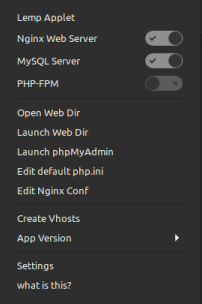

# LEMP Stack - A Cinnamon applet

To use this applets you must have the following packages installed.

- nginx
- php-fpm

## Acknowledgments

- [gjs](https://gjs-docs.gnome.org/)
- [cjs exmple](https://github.com/linuxmint/cjs/tree/master/examples)
- melange cinnamon debugger
